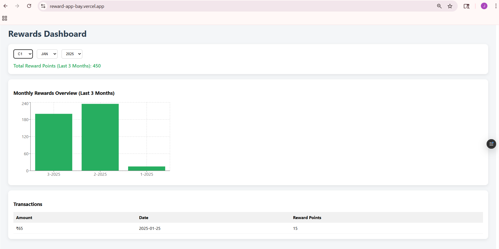

# Reward Points Dashboard

##  Overview

This project calculates customer reward points based on transaction history over a 3-month period.

##  Reward Logic

* 2 points for every $1 spent over $100
* 1 point for every $1 spent between $50 and $100

Example:
$120 → (20×2) + (50×1) = 90 points

##  Tech Stack

* React (Vite)
* Context API
* Styled Components
* Recharts
* Pino Logger
* Vitest (Unit Testing)

##  Features

* Dynamic customer selection
* Monthly reward calculation
* Total reward points
* Month & Year filter
* Transaction-level reward display
* Chart visualization
* Pagination-ready structure
* Logging using pino
* Error handling & loading state

##  Folder Structure

Explain briefly (copy from project)

##  Run Project

npm install
npm run dev

##  Run Tests

npx vitest

##  Screenshots

##  Notes

* Mock API used via JSON
* No hardcoded data in components
* Clean architecture followed

##  Author

Jyotsna Kumari
